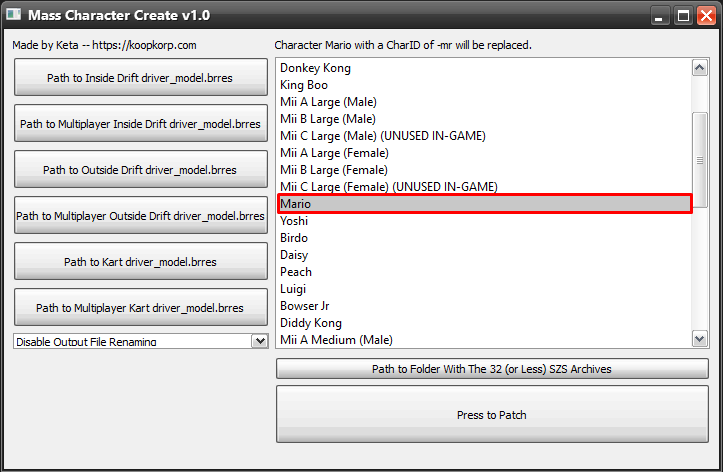
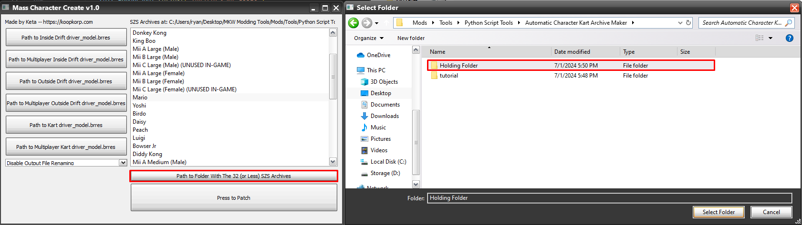
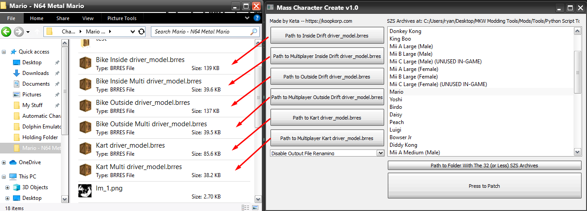
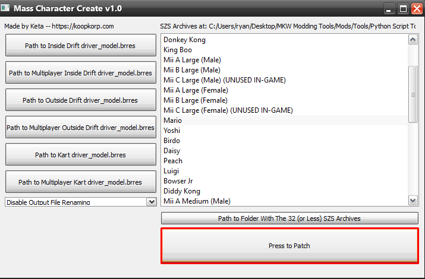

# Mass Character Creator
Replaces all 32 files of a character in the Race/Kart folder with 6 driver_model.brres files provided by you.
Takes into account oddities such as large characters using Inside Drift animations on standard bike or small characters using Inside Drift animations on every Outside Drift bike.

## Prerequisites
- [Python 3](https://www.python.org/downloads/release/python-3124/)
- [PyQt5](https://pypi.org/project/PyQt5) ```pip install pyqt5```
- [Wiimms SZS Tools](https://szs.wiimm.de/download.html)

PyInstaller compiled EXE of the provided .py file is available in releases.

## How to use

1. Select the character whos files you wish to modify. In these examples I am modifying Mario.


2. Provide the folder filled with the 32 (or less) xx_kart/bike-xx.szs files you wish to modify. As I am modifying Mario I put all of Mario's files in there (EX. ma_bike-mr.szs, ma_kart-mr.szs, etc.)


3. Provide your 6 modified driver_model.brres files. One is for Inside Drift Bikes, one is for Outside Drift Bikes, and one is for Karts. The other 3 files are their splitscreen _4 equivalents.


(OPTIONAL) Set a character to rename the output files charids to. It will rename all the new szs files made by the program to the selected characters CharID.
Leave this as disabled if you have no reason to rename your files to a different character.


4. Press the Patch button. The program will extract all of the SZS files, appropriately replace the driver_model.brres files with the ones supplied, then replace the SZS files in the folder with the new ones.

